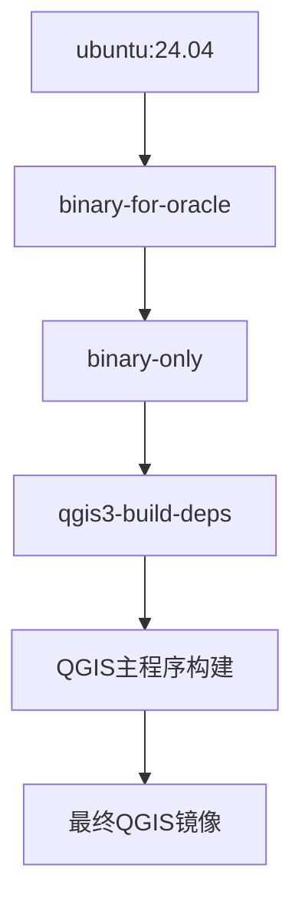

# QGIS Docker构建完整指南

本文档详细介绍QGIS项目的Docker构建方案，包括官方构建系统和优化方案。

## 目录
- [概述](#概述)
- [QGIS官方Docker构建体系](#qgis官方docker构建体系)
- [构建方案对比](#构建方案对比)
- [快速开始](#快速开始)
- [问题排查](#问题排查)
- [脚本说明](#脚本说明)

## 概述

QGIS提供了完整的Docker构建体系，用于：
- 持续集成和自动化测试
- 标准化的构建环境
- 跨平台构建支持
- 开发环境隔离

### 项目中的Docker文件结构
```
.docker/
├── qgis3-qt5-build-deps.dockerfile  # Qt5依赖镜像
├── qgis3-qt6-build-deps.dockerfile  # Qt6依赖镜像  
├── qgis.dockerfile                  # 主构建文件
├── docker-qgis-build.sh            # 官方构建脚本
├── docker-qgis-test.sh             # 测试脚本
├── docker-compose-*.yml            # 测试环境编排
└── qgis_resources/                  # 测试资源
```

## QGIS官方Docker构建体系

### 1. 多阶段构建架构



### 2. 核心组件

#### 依赖镜像 (qgis3-build-deps)
- **基础系统**: Ubuntu 24.04
- **构建工具**: clang, cmake, ninja, ccache
- **Qt框架**: Qt5完整开发套件
- **地理空间库**: GDAL, GEOS, PROJ, SpatiaLite
- **Python环境**: Python3 + PyQt5完整绑定
- **数据库支持**: PostgreSQL, Oracle, MSSQL, HANA

#### 主构建文件 (qgis.dockerfile)
```dockerfile
FROM qgis/qgis3-build-deps:latest AS BUILDER
# 使用官方依赖镜像
COPY . /QGIS                    # 复制源码
RUN cmake -GNinja ...           # 配置构建
RUN ninja install               # 编译安装
```

### 3. 构建配置特点

- **编译器**: Clang + ccache加速
- **构建系统**: Ninja (比make更快)
- **完整功能**: Desktop + Server + 3D + Python绑定
- **测试支持**: 完整的测试框架集成
- **多数据库**: Oracle, MSSQL, PostgreSQL, HANA支持

## 构建方案对比

| 方案 | 构建时间 | Python支持 | 完整功能 | 网络依赖 | 推荐度 |
|------|----------|------------|----------|----------|--------|
| 官方Docker | 60分钟(首次)/20分钟(后续) | ✅ 完整 | ✅ 完整 | 🌐 中等 | ⭐⭐⭐⭐⭐ |
| 简化Docker | 25分钟 | ❌ 无 | ⚠️ 基础 | 🌐 中等 | ⭐⭐⭐⭐ |
| 本地构建 | 30分钟 | ❌ 无 | ⚠️ 基础 | ❌ 无 | ⭐⭐⭐ |
| 预编译下载 | 5分钟 | ✅ 完整 | ✅ 完整 | 🌐 高 | ⭐⭐⭐ |
| 传统构建 | 2小时+ | ✅ 完整 | ✅ 完整 | ❌ 无 | ⭐⭐ |

## 快速开始

### 前置条件
```bash
# 安装Docker
sudo apt update && sudo apt install docker.io
sudo systemctl start docker
sudo usermod -aG docker $USER  # 重新登录生效
```

### 方案1: 官方Docker构建（推荐）

```bash
# 使用官方构建系统
./scripts/build_official_docker.sh
```

**特点**:
- ✅ 使用QGIS团队同样的构建流程
- ✅ 完整功能支持（Python、3D、所有数据库）
- ✅ 经过充分测试和优化
- ⏱️ 首次构建60分钟，后续20分钟

### 方案2: 简化Docker构建

```bash
# 快速构建（无Python绑定）
./scripts/build_with_docker.sh
```

**特点**:
- ✅ 核心GIS功能完整
- ❌ 无Python插件和脚本支持  
- ⏱️ 25分钟完成

### 方案3: 本地构建

```bash
# 无Docker依赖的本地构建
./scripts/build_local_fast.sh
```

**特点**:
- ✅ 无网络依赖
- ✅ 系统集成度高
- ❌ 环境不隔离
- ⏱️ 30分钟完成

## 问题排查

### Docker网络问题

#### 症状
```
Get \"https://registry-1.docker.io/v2/\": dial tcp: i/o timeout
```

#### 解决方案
```bash
# 配置国内镜像源
./scripts/setup_docker_mirror.sh

# 或手动下载镜像
./scripts/download_docker_images.sh
```

### 构建缓慢问题

#### SIP Python绑定生成慢
```bash
# 症状：卡在sip-build步骤
/usr/bin/python3 /usr/bin/sip-build --no-protected-is-public...
```

#### 解决方案
1. **使用官方Docker** - 已优化此问题
2. **跳过Python绑定** - 使用简化构建
3. **增加内存** - 确保至少8GB可用内存

### 磁盘空间不足

```bash
# 检查空间
df -h

# 清理Docker
docker system prune -a

# 使用外部存储
export DOCKER_TMPDIR=/path/to/large/disk
```

## 脚本说明

### 官方构建脚本

#### `build_official_docker.sh`
- 基于QGIS官方构建系统
- 多阶段构建优化
- 完整功能支持

#### `setup_docker_mirror.sh`  
- 配置Docker国内镜像源
- 解决网络连接问题

### 简化构建脚本

#### `build_with_docker.sh`
- 快速Docker构建
- 禁用Python绑定
- 适合功能测试

#### `build_local_fast.sh`
- 本地环境构建  
- 无Docker依赖
- 使用系统库

### 下载脚本

#### `download_qgis_packages.sh`
- 下载官方预编译包
- 支持Ubuntu/Debian
- 最快获得QGIS

#### `download_docker_images.sh`
- 手动下载Docker镜像
- 使用国内镜像源
- 解决网络问题

## Docker构建详细流程

### 官方构建步骤

1. **构建依赖镜像**
```bash
docker build -f .docker/qgis3-qt5-build-deps.dockerfile -t qgis3-build-deps .docker/
```

2. **构建主程序**
```bash  
docker build -f .docker/qgis.dockerfile -t qgis-local .
```

3. **导出结果**
```bash
docker cp container_id:/usr/ output/
dpkg-deb --build output/ qgis-official.deb
```

### 构建优化配置

#### CMake配置
```cmake
cmake -GNinja \
  -DCMAKE_BUILD_TYPE=Release \
  -DWITH_DESKTOP=ON \
  -DWITH_SERVER=ON \
  -DWITH_3D=ON \
  -DWITH_BINDINGS=ON \
  -DENABLE_TESTS=OFF \
  -DUSE_CCACHE=ON
```

#### 编译优化
- **Ninja构建系统**: 比make快30%
- **ccache缓存**: 重复构建加速
- **并行编译**: 使用所有CPU核心
- **链接器优化**: 使用mold链接器

## 最佳实践

### 开发环境推荐

1. **日常开发**: 使用官方Docker构建
2. **功能测试**: 使用简化Docker构建  
3. **快速验证**: 使用预编译包下载
4. **离线环境**: 使用本地构建

### 性能优化

1. **增加内存**: 至少8GB，推荐16GB
2. **SSD存储**: 显著提升构建速度
3. **网络优化**: 配置镜像源
4. **缓存利用**: 保留Docker层缓存

### 故障排除

1. **日志查看**:
```bash
docker logs container_id
```

2. **交互调试**:
```bash  
docker run -it qgis3-build-deps /bin/bash
```

3. **资源监控**:
```bash
docker stats
htop
```

## 总结

QGIS的Docker构建系统为开发者提供了标准化、可重现的构建环境。建议：

- **生产使用**: 官方Docker构建
- **快速测试**: 简化Docker构建  
- **网络受限**: 本地构建
- **即时使用**: 预编译包下载

选择合适的构建方案可以大幅提升开发效率，避免环境配置问题。