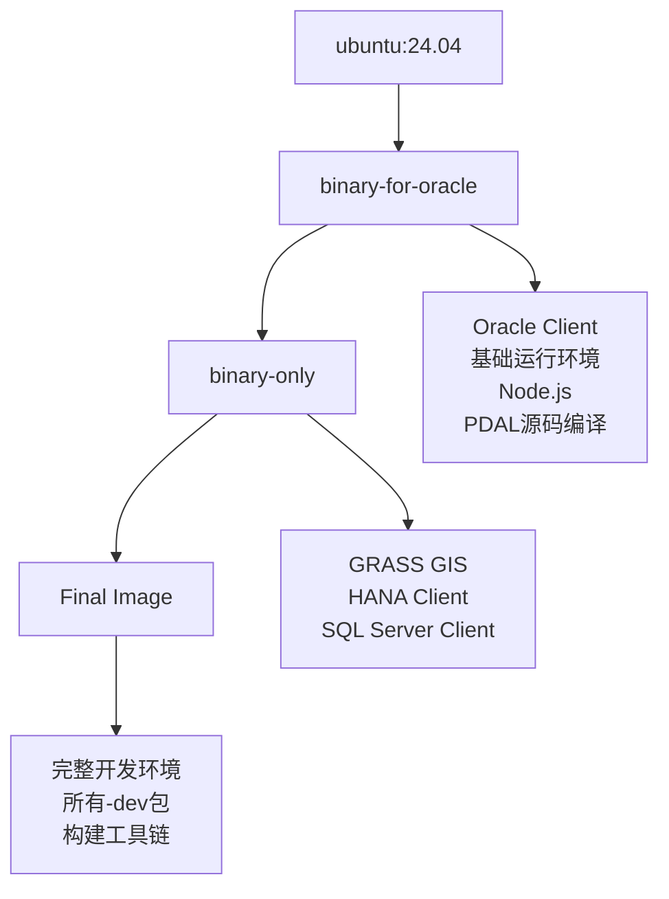

# QGIS Qt5构建依赖Dockerfile详解

## 概述

`qgis3-qt5-build-deps.dockerfile` 是QGIS项目用于构建基于Qt5的完整开发环境的Docker文件。这个文件创建了一个包含所有必要工具、库和企业级数据库客户端的构建基础镜像。

## 文件功能和用途

### 主要功能
- **多阶段构建**：通过三个构建阶段逐步添加功能组件
- **企业级数据库支持**：集成Oracle、SQL Server、SAP HANA客户端
- **完整开发环境**：包含Qt5、Python、地理空间库等全套开发工具
- **GitHub Actions优化**：针对CI/CD环境的空间和资源优化

### 核心特性
- ✅ **基于Ubuntu 24.04**：使用最新LTS版本确保稳定性
- ✅ **Qt5完整支持**：包含Qt5所有模块和开发工具
- ✅ **Python3生态**：完整的PyQt5绑定和科学计算库
- ✅ **企业数据库**：Oracle、SQL Server、SAP HANA客户端支持
- ✅ **点云处理**：从源码编译最新版PDAL库
- ✅ **多媒体支持**：Node.js、X11、字体等完整运行环境

## Dockerfile结构详细分析

### 1. 基础配置和参数 (第1-16行)

```dockerfile
ARG DISTRO_VERSION=24.04
ARG PDAL_VERSION=2.8.4

# Oracle Docker image is too large, so we add as less dependencies as possible
# so there is enough space on GitHub runner
FROM ubuntu:${DISTRO_VERSION} AS binary-for-oracle
LABEL org.opencontainers.image.authors="Denis Rouzaud <denis@opengis.ch>"
LABEL Description="Docker container with QGIS dependencies" Vendor="QGIS.org" Version="1.0"

ARG PDAL_VERSION

# && echo "deb http://ppa.launchpad.net/ubuntugis/ubuntugis-unstable/ubuntu xenial main" >> /etc/apt/sources.list \
# && echo "deb-src http://ppa.launchpad.net/ubuntugis/ubuntugis-unstable/ubuntu xenial main" >> /etc/apt/sources.list \
# && apt-key adv --keyserver keyserver.ubuntu.com --recv-keys 314DF160 \
```

**设计理念**：
- **空间优化**：Oracle客户端占用大量空间，需要精细控制依赖
- **版本参数化**：支持不同Ubuntu版本和PDAL版本
- **PPA预留**：注释的PPA配置为地理空间软件更新预留

### 2. 第一阶段：基础运行环境 (第18-116行)

```dockerfile
RUN apt-get update \
  && apt-get install -y software-properties-common \
  && apt-get update \
  && DEBIAN_FRONTEND=noninteractive apt-get install -y \
    # 系统基础工具
    apt-transport-https \
    ca-certificates \
    clazy \                    # Qt静态分析工具
    cmake \
    curl \
    dh-python \
    git \
    gdal-bin \
    gnupg \
    gpsbabel \                 # GPS数据转换工具
    graphviz \                 # 图形可视化
    
    # 兼容性库（支持不同Ubuntu版本）
    'libaio1|libaio1t64' \
    'libdraco4|libdraco8' \
    libexiv2-27 \
    'libfcgi0ldbl|libfcgi0t64' \
    libgsl27 \
    'libprotobuf-lite17|libprotobuf-lite23|libprotobuf-lite32t64' \
    
    # Qt5运行时库
    libqca-qt5-2-plugins \     # Qt加密架构
    libqt53dextras5 \          # Qt3D附加组件
    libqt53drender5 \          # Qt3D渲染引擎
    'libqt5concurrent5|libqt5concurrent5t64' \
    libqt5keychain1 \          # 安全密钥存储
    libqt5positioning5 \       # GPS定位服务
    libqt5multimedia5 \        # 多媒体支持
    libqt5multimediawidgets5 \
    libqt5qml5 \               # QML脚本引擎
    libqt5quick5 \             # Qt Quick UI
    libqt5quickcontrols2-5 \
    libqt5quickwidgets5 \
    libqt5serialport5 \        # 串口通信（GPS设备）
    libqt5sql5-odbc \          # ODBC数据库连接
    libqt5sql5-sqlite \        # SQLite数据库
    'libqt5xml5|libqt5xml5t64' \
    libqt5webkit5 \            # Web浏览器引擎
    
    # 地理空间和科学计算库
    libqwt-qt5-6 \             # Qt科学绘图库
    libspatialindex6 \         # 空间索引
    libsqlite3-mod-spatialite \ # SQLite空间扩展
    'libzip4|libzip5|libzip4t64' \
    
    # 服务器和工具
    lighttpd \                 # 轻量级Web服务器
    locales \
    poppler-utils \            # PDF处理工具
    
    # Python3科学计算生态
    python3-future \
    python3-gdal \             # GDAL Python绑定
    python3-mock \
    python3-nose2 \            # 测试框架
    python3-numpy \            # 数值计算
    python3-owslib \           # OGC Web服务客户端
    python3-pip \
    python3-psycopg2 \         # PostgreSQL适配器
    python3-pyproj \           # 坐标转换
    python3-pyqt5 \            # PyQt5基础绑定
    python3-pyqt5.qsci \       # QScintilla编辑器
    python3-pyqt5.qtsql \      # SQL模块
    python3-pyqt5.qtsvg \      # SVG支持
    python3-pyqt5.qtwebkit \   # WebKit浏览器
    python3-pyqt5.qtpositioning \
    python3-pyqt5.qtmultimedia \
    python3-pyqt5.qtserialport \
    python3-sip \              # SIP绑定生成器
    python3-termcolor \
    python3-yaml \
    
    # 3D和图形处理
    qpdf \                     # PDF操作库
    qt3d-assimpsceneimport-plugin \  # 3D模型导入
    qt3d-defaultgeometryloader-plugin \
    qt3d-gltfsceneio-plugin \
    qt3d-scene2d-plugin \
    qt5-image-formats-plugins \
    
    # GIS专业软件
    saga \                     # SAGA GIS
    supervisor \               # 进程管理
    
    # X11和显示支持
    unzip \
    xauth \
    xfonts-100dpi \
    xfonts-75dpi \
    xfonts-base \
    xfonts-scalable \
    xvfb \                     # 虚拟显示服务器
    ocl-icd-libopencl1 \       # OpenCL支持
```

**Python包通过pip安装**：
```dockerfile
&& pip3 install --break-system-packages \
    numpy \
    nose2 \
    pyyaml \
    mock \
    future \
    termcolor \
    oauthlib \                 # OAuth认证
    pyopenssl \                # SSL/TLS支持
    pep8 \                     # 代码风格检查
    pexpect \                  # 自动化交互
    capturer \                 # 输出捕获
    sphinx \                   # 文档生成
    requests \                 # HTTP客户端
    six \                      # Python2/3兼容
    hdbcli \                   # SAP HANA客户端
    shapely \                  # 几何运算
&& apt-get clean
```

### 3. Node.js环境配置 (第118-124行)

```dockerfile
# Node.js and Yarn for server landingpage webapp
RUN mkdir -p /etc/apt/keyrings
RUN curl -fsSL https://deb.nodesource.com/gpgkey/nodesource-repo.gpg.key | gpg --dearmor -o /etc/apt/keyrings/nodesource.gpg
RUN echo "deb [signed-by=/etc/apt/keyrings/nodesource.gpg] https://deb.nodesource.com/node_22.x nodistro main" | tee /etc/apt/sources.list.d/nodesource.list
RUN apt-get update
RUN apt-get install -y nodejs
RUN corepack enable
```

**用途**：为QGIS Server的Web管理界面提供现代前端开发环境

### 4. Oracle客户端集成 (第126-138行)

```dockerfile
# Oracle : client side
RUN curl https://download.oracle.com/otn_software/linux/instantclient/2116000/instantclient-basic-linux.x64-21.16.0.0.0dbru.zip > instantclient-basic-linux.x64-21.16.0.0.0dbru.zip
RUN curl https://download.oracle.com/otn_software/linux/instantclient/2116000/instantclient-sdk-linux.x64-21.16.0.0.0dbru.zip > instantclient-sdk-linux.x64-21.16.0.0.0dbru.zip
RUN curl https://download.oracle.com/otn_software/linux/instantclient/2116000/instantclient-sqlplus-linux.x64-21.16.0.0.0dbru.zip > instantclient-sqlplus-linux.x64-21.16.0.0.0dbru.zip

RUN unzip -n instantclient-basic-linux.x64-21.16.0.0.0dbru.zip
RUN unzip -n instantclient-sdk-linux.x64-21.16.0.0.0dbru.zip
RUN unzip -n instantclient-sqlplus-linux.x64-21.16.0.0.0dbru.zip

ENV PATH="/instantclient_21_16:${PATH}"
ENV LD_LIBRARY_PATH="/instantclient_21_16"

# workaround noble libaio SONAME issue -- see https://bugs.launchpad.net/ubuntu/+source/libaio/+bug/2067501
RUN if [ -e /usr/lib/x86_64-linux-gnu/libaio.so.1t64 ] ; then ln -sf /usr/lib/x86_64-linux-gnu/libaio.so.1t64 /usr/lib/x86_64-linux-gnu/libaio.so.1 ; fi
```

**企业级支持**：
- **Oracle Instant Client 21.16**：最新版Oracle数据库客户端
- **完整组件**：basic（运行时）+ SDK（开发）+ SQL*Plus（管理工具）
- **兼容性修复**：解决Ubuntu 24.04的libaio库命名问题

### 5. 区域设置和别名 (第140-145行)

```dockerfile
# Avoid sqlcmd termination due to locale -- see https://github.com/Microsoft/mssql-docker/issues/163
RUN echo "nb_NO.UTF-8 UTF-8" > /etc/locale.gen
RUN echo "en_US.UTF-8 UTF-8" >> /etc/locale.gen
RUN locale-gen

RUN echo "alias python=python3" >> ~/.bash_aliases
```

### 6. PDAL点云库源码编译 (第147-164行)

```dockerfile
# PDAL is not available in ubuntu 24.04
# Install it from source
# PDAL dependencies
RUN apt-get update \
     && DEBIAN_FRONTEND=noninteractive apt-get install -y \
     ninja-build \
     libgdal-dev \
     libproj-dev

# download PDAL and compile it
RUN curl -L https://github.com/PDAL/PDAL/releases/download/${PDAL_VERSION}/PDAL-${PDAL_VERSION}-src.tar.gz --output PDAL-${PDAL_VERSION}-src.tar.gz \
    && mkdir pdal \
    && tar zxf PDAL-${PDAL_VERSION}-src.tar.gz -C pdal --strip-components=1 \
    && rm -f PDAL-${PDAL_VERSION}-src.tar.gz \
    && mkdir -p pdal/build \
    && cd pdal/build \
    && cmake -GNinja -DCMAKE_INSTALL_PREFIX=/usr/local -DWITH_TESTS=OFF .. \
    && ninja \
    && ninja install
```

**现代点云处理**：Ubuntu 24.04软件源中没有PDAL，需要从源码编译最新版本2.8.4

### 7. 第二阶段：数据库客户端扩展 (第166-194行)

```dockerfile
FROM binary-for-oracle AS binary-only

RUN apt-get update \
  && DEBIAN_FRONTEND=noninteractive apt-get install -y \
    grass \                  # GRASS GIS完整版
    iproute2 \              # 网络工具
    postgresql-client \      # PostgreSQL客户端
    spawn-fcgi \            # FastCGI进程管理
  && pip3 install --break-system-packages \
    psycopg2 \              # PostgreSQL Python驱动
  && apt-get clean

# HANA: client side
# Install hdbsql tool
RUN curl -j -k -L -H "Cookie: eula_3_2_agreed=tools.hana.ondemand.com/developer-license-3_2.txt" https://tools.hana.ondemand.com/additional/hanaclient-latest-linux-x64.tar.gz --output hanaclient-latest-linux-x64.tar.gz \
  && tar -xvf hanaclient-latest-linux-x64.tar.gz \
  && mkdir /usr/sap \
  && ./client/hdbinst -a client --sapmnt=/usr/sap \
  && rm -rf client \
  && rm hanaclient*
ENV PATH="/usr/sap/hdbclient:${PATH}"

# MSSQL: client side
RUN curl -sSL -O https://packages.microsoft.com/config/ubuntu/$(grep VERSION_ID /etc/os-release | cut -d '"' -f 2)/packages-microsoft-prod.deb
RUN dpkg -i packages-microsoft-prod.deb
RUN rm packages-microsoft-prod.deb
RUN apt-get update
RUN ACCEPT_EULA=Y apt-get install -y --allow-unauthenticated msodbcsql18 mssql-tools18
ENV PATH="/opt/mssql-tools18/bin:${PATH}"
```

**企业数据库全覆盖**：
- **SAP HANA**：自动接受许可协议，安装最新客户端
- **SQL Server**：微软官方ODBC驱动和命令行工具
- **PostgreSQL**：开源数据库完整支持

### 8. 第三阶段：完整开发环境 (第196-249行)

```dockerfile
FROM binary-only

RUN apt-get update \
  && DEBIAN_FRONTEND=noninteractive apt-get install -y \
    # 构建工具链
    bison \                    # 语法分析器生成器
    ccache \                   # 编译缓存
    clang \                    # LLVM编译器
    cmake \                    # 构建系统
    flex \                     # 词法分析器生成器
    
    # 开发库头文件
    grass-dev \                # GRASS GIS开发包
    libdraco-dev \             # Google Draco 3D压缩
    libexiv2-dev \             # 图像元数据处理
    libexpat1-dev \            # XML解析器
    libfcgi-dev \              # FastCGI开发包
    libgeos-dev \              # 几何运算库
    libgsl-dev \               # GNU科学计算库
    libpq-dev \                # PostgreSQL开发包
    libprotobuf-dev \          # Google Protocol Buffers
    
    # Qt5开发环境
    libqca-qt5-2-dev \         # Qt加密架构开发包
    libqt5opengl5-dev \        # OpenGL集成
    libqt5scintilla2-dev \     # 代码编辑器组件
    libqt5svg5-dev \           # SVG支持
    libqt5webkit5-dev \        # WebKit浏览器引擎
    libqt5serialport5-dev \    # 串口通信
    libqwt-qt5-dev \           # 科学绘图库
    
    # 空间数据库和索引
    libspatialindex-dev \      # R-tree空间索引
    libspatialite-dev \        # SQLite空间扩展
    libsqlite3-dev \
    libsqlite3-mod-spatialite \
    
    # 压缩和协议
    libzip-dev \
    libzstd-dev \              # Facebook Zstandard压缩
    protobuf-compiler \        # Protocol Buffers编译器
    
    # Python开发环境
    pyqt5-dev \                # PyQt5开发工具
    pyqt5-dev-tools \
    pyqt5.qsci-dev \           # QScintilla开发包
    python3-all-dev \          # Python3完整开发环境
    python3-dev \
    python3-sip-dev \          # SIP绑定生成器
    
    # Qt5核心开发包
    qt3d5-dev \                # Qt3D开发包
    qt5keychain-dev \          # 密钥链开发包
    qtbase5-dev \              # Qt5基础开发包
    qtdeclarative5-dev-tools \ # QML开发工具
    qtpositioning5-dev \       # 定位服务开发包
    qtmultimedia5-dev \        # 多媒体开发包
    qttools5-dev \             # Qt工具链
    qttools5-dev-tools \
    qtbase5-private-dev \      # Qt私有API
    
    # OpenCL并行计算
    opencl-headers \
    ocl-icd-opencl-dev \
  && apt-get clean

ENV PATH="/usr/local/bin:${PATH}"

# environment variables shall be located in .docker/docker-variables.env
```

## 多阶段构建优化分析

### 构建阶段设计



### 空间优化策略

| 阶段 | 主要内容 | 大小估算 | 优化策略 |
|------|----------|----------|----------|
| **binary-for-oracle** | 基础系统+Oracle | ~800MB | 最小化Oracle依赖 |
| **binary-only** | 添加数据库客户端 | +200MB | 分离运行时和开发包 |
| **最终镜像** | 完整开发环境 | +500MB | 清理缓存，合并命令 |

### GitHub Actions适配

```dockerfile
# Oracle Docker image is too large, so we add as less dependencies as possible
# so there is enough space on GitHub runner
```

**限制条件**：
- GitHub Actions runner磁盘空间限制
- Docker layer缓存大小限制
- 构建时间优化需求

## Qt5 vs Qt6 架构对比

| 特性 | Qt5构建环境 | Qt6构建环境 |
|------|------------|------------|
| **基础系统** | Ubuntu 24.04 | Fedora 39 |
| **包管理器** | APT | DNF |
| **Python绑定** | PyQt5 | PyQt6 |
| **构建阶段** | 3阶段 | 2阶段 |
| **空间优化** | 高度优化 | 相对简单 |
| **企业数据库** | 全支持 | Oracle为主 |
| **现代工具** | 基础支持 | mold链接器等 |

## 使用指南

### 1. 基本构建使用

#### 构建依赖镜像
```bash
# 在QGIS源码根目录
cd /home/sen/dev/cpp/QGIS

# 构建Qt5依赖镜像
docker build -f .docker/qgis3-qt5-build-deps.dockerfile \
  -t qgis/qgis3-build-deps:qt5-latest \
  .docker/

# 查看镜像大小
docker images | grep qgis3-build-deps
```

#### 自定义版本构建
```bash
# 使用不同Ubuntu版本
docker build \
  --build-arg DISTRO_VERSION=22.04 \
  --build-arg PDAL_VERSION=2.7.2 \
  -f .docker/qgis3-qt5-build-deps.dockerfile \
  -t qgis3-build-deps:ubuntu22 \
  .docker/
```

### 2. 验证构建环境

#### 测试Qt5环境
```bash
# 启动交互式容器
docker run -it --rm qgis/qgis3-build-deps:qt5-latest bash

# 验证Qt5安装
qmake --version
python3 -c "from PyQt5.QtCore import QT_VERSION_STR; print('PyQt5:', QT_VERSION_STR)"

# 验证地理空间库
python3 -c "import gdal; print('GDAL:', gdal.__version__)"
python3 -c "import shapely; print('Shapely:', shapely.__version__)"

# 验证数据库客户端
sqlcmd -?  # SQL Server
hdbsql -v  # SAP HANA
sqlplus -V # Oracle
```

#### 测试编译环境
```bash
# 验证构建工具
cmake --version
ninja --version
clang --version
ccache --version

# 验证开发包
pkg-config --modversion Qt5Core
pkg-config --modversion gdal
```

### 3. 开发环境使用

#### 作为QGIS构建基础
```bash
# 使用此镜像构建QGIS
docker run --rm -it \
  -v $(pwd):/QGIS \
  -w /QGIS \
  qgis/qgis3-build-deps:qt5-latest \
  ./.docker/docker-qgis-build.sh
```

#### 插件开发环境
```bash
# 创建插件开发环境
docker run -it --rm \
  -v $(pwd)/plugins:/workspace \
  -v /tmp/.X11-unix:/tmp/.X11-unix \
  -e DISPLAY=$DISPLAY \
  qgis/qgis3-build-deps:qt5-latest bash

# 在容器内开发PyQt5插件
cd /workspace
python3 -c "
from PyQt5.QtWidgets import QApplication, QMainWindow
app = QApplication([])
window = QMainWindow()
window.show()
print('PyQt5 GUI environment ready')
"
```

### 4. 企业数据库连接测试

#### Oracle数据库
```bash
# 测试Oracle连接
docker run --rm -it \
  -e ORACLE_HOST=your-oracle-host \
  -e ORACLE_USER=your-user \
  qgis/qgis3-build-deps:qt5-latest \
  sqlplus $ORACLE_USER@$ORACLE_HOST
```

#### SQL Server数据库
```bash
# 测试SQL Server连接
docker run --rm -it \
  -e MSSQL_HOST=your-mssql-host \
  -e MSSQL_USER=your-user \
  qgis/qgis3-build-deps:qt5-latest \
  sqlcmd -S $MSSQL_HOST -U $MSSQL_USER
```

#### SAP HANA数据库
```bash
# 测试HANA连接
docker run --rm -it \
  -e HANA_HOST=your-hana-host \
  -e HANA_USER=your-user \
  qgis/qgis3-build-deps:qt5-latest \
  hdbsql -n $HANA_HOST -u $HANA_USER
```

### 5. 自定义扩展

#### 添加额外Python库
```dockerfile
FROM qgis/qgis3-build-deps:qt5-latest

# 安装额外的科学计算库
RUN pip3 install --break-system-packages \
    pandas \
    matplotlib \
    seaborn \
    scikit-learn \
    jupyterlab

# 添加GIS专用库
RUN pip3 install --break-system-packages \
    rasterio \
    fiona \
    geopandas \
    folium
```

#### 添加额外系统工具
```dockerfile
FROM qgis/qgis3-build-deps:qt5-latest

# 安装开发调试工具
RUN apt-get update && apt-get install -y \
    gdb \
    valgrind \
    strace \
    htop \
    tree \
    vim \
    && apt-get clean
```

### 6. 性能优化配置

#### 构建缓存优化
```bash
# 使用BuildKit并行构建
export DOCKER_BUILDKIT=1
docker build \
  --progress=plain \
  -f .docker/qgis3-qt5-build-deps.dockerfile \
  -t qgis3-build-deps:optimized \
  .docker/
```

#### 多阶段并行构建
```bash
# 只构建到特定阶段
docker build \
  --target binary-for-oracle \
  -f .docker/qgis3-qt5-build-deps.dockerfile \
  -t qgis3-oracle-only \
  .docker/
```

### 7. 故障排除

#### 常见构建问题

**问题1：Oracle客户端下载失败**
```bash
# 检查网络连接
docker build --no-cache \
  --progress=plain \
  -f .docker/qgis3-qt5-build-deps.dockerfile \
  -t debug-build .docker/ 2>&1 | grep -i oracle
```

**问题2：PDAL编译失败**
```bash
# 查看PDAL编译日志
docker build --no-cache \
  --progress=plain \
  -f .docker/qgis3-qt5-build-deps.dockerfile \
  -t debug-pdal .docker/ 2>&1 | grep -A20 -B5 "cmake.*PDAL"
```

**问题3：空间不足**
```bash
# 清理Docker空间
docker system prune -a
docker volume prune

# 检查空间使用
docker system df
```

## 总结

`qgis3-qt5-build-deps.dockerfile` 是一个**企业级的完整开发环境构建文件**，具有以下特点：

### 优势
- ✅ **完整性**：包含QGIS开发所需的所有工具和库
- ✅ **企业级**：支持Oracle、SQL Server、SAP HANA等主流企业数据库
- ✅ **优化设计**：多阶段构建有效控制镜像大小
- ✅ **现代标准**：基于Ubuntu 24.04 LTS，支持最新技术栈
- ✅ **Python生态**：完整的PyQt5和科学计算库支持

### 适用场景
- **QGIS核心开发**：官方开发团队的标准构建环境
- **企业GIS项目**：需要连接多种数据库的大型GIS项目
- **插件开发**：PyQt5插件开发的标准化环境
- **CI/CD流水线**：GitHub Actions等持续集成环境

### 技术亮点
- **空间优化**：针对GitHub Actions的存储限制进行精细优化
- **兼容性处理**：处理Ubuntu版本差异和库命名变更
- **源码编译**：PDAL等关键库的最新版本支持
- **多阶段构建**：有效分离运行时和开发时依赖

这个Dockerfile体现了QGIS项目的技术深度和对企业用户需求的深刻理解，是构建企业级GIS应用的重要基础。