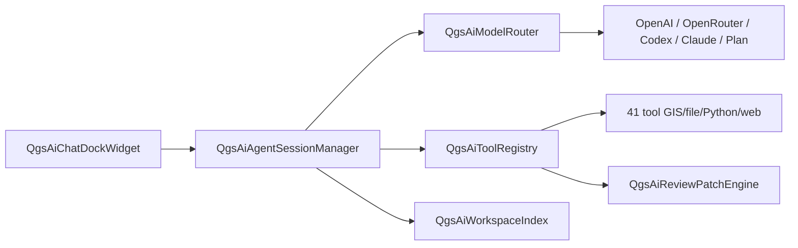

# Roadmap Strata: diventare il "Cursor per QGIS/GIS"

> **Strata**: ambiente GIS agentico, locale, sicuro e riproducibile — da richiesta tecnica a mappa, analisi e report verificabile in pochi minuti.
>
> Principi guida: context-first, action-first, review-first, local-first, reproducible-first, vertical-first.
>
> **Revisione:** luglio 2026 — allineata allo stato reale del codice in `src/app/ai/` (~98 file, **41 tool** registrati, `.strataflow` v0 nel dock). Formato checklist: ogni fase riporta la percentuale di completamento nel titolo e lo stato puntuale nelle checkbox.

---

## Indice

1. [Stato attuale](#0-stato-attuale-luglio-2026)
2. [Fase 0 — Fondamenta prodotto e distribuzione — 50%](#fase-0--fondamenta-prodotto-e-distribuzione--50)
3. [Fase 1 — Assistant operativo MVP — 90%](#fase-1--assistant-operativo-mvp--90)
4. [Fase 2 — Strata Context Engine — 60%](#fase-2--strata-context-engine--60)
5. [Fase 3 — GIS Tab — 15%](#fase-3--gis-tab--15)
6. [Fase 4 — Agent Mode v2 — 50%](#fase-4--agent-mode-v2--50)
7. [Fase 5 — Workflow Composer e riproducibilità — 20%](#fase-5--workflow-composer-e-riproducibilità--20)
8. [Fase 6 — Vertical Packs — 0%](#fase-6--vertical-packs--0)
9. [Fase 7 — Team ed Enterprise — 0%](#fase-7--team-ed-enterprise--0)
10. [Fase 8 — Strata CLI, GIS Workers e automazioni — 0%](#fase-8--strata-cli-gis-workers-e-automazioni--0)
11. [Fase 9 — GIS Review — 0%](#fase-9--gis-review--0)
12. [Fase 10 — Marketplace, SDK e community — 0%](#fase-10--marketplace-sdk-e-community--0)
13. [Sezione 13 — AI-GAP: chiusura gap tool GIS core — 100%](#sezione-13--ai-gap-chiusura-gap-tool-gis-core--100)
14. [Sezione 14 — AI-MAP: Map Context Engine + 3D — 0%](#sezione-14--ai-map-map-context-engine--3d--0)
15. [Metriche](#metriche)
16. [Sequenza sprint](#sequenza-sprint)

---

# 0. Stato attuale (luglio 2026)

## Legenda

- `[x]` — implementato e utilizzabile in produzione
- `[ ]` — mancante
- Item `[ ]` con sotto-checkbox miste — parziale: le sub-voci `[x]` dicono cosa esiste, le `[ ]` cosa manca
- Le percentuali di fase sono **pesate per effort**, non il semplice rapporto checkbox (il rapporto grezzo è indicato dove diverge)
- Gli ID tra parentesi (CTX/AGT/TAB/REV/WFL/ENT/MAP) sono gli ID dell'ex backlog dettagliato, ora inline

## Vista d'insieme

| Fase                           | %    | Gap principale                                                             |
| ------------------------------ | ---- | -------------------------------------------------------------------------- |
| 0 — Fondamenta                 | 50%  | demo project, telemetria, auto-update in-app, wizard AI                    |
| 1 — Assistant MVP              | 90%  | execution log JSON, risk policy formale, modalità Expert, `inspect_crs`    |
| 2 — Context Engine             | 60%  | project graph completo, summarizer stili/layout, context packs, preview UI |
| 3 — GIS Tab                    | 15%  | tab UI dedicata, shortcut Tab/Esc, ranking, analytics                      |
| 4 — Agent v2                   | 50%  | JSON planner, step verifier, GIS diff/rollback strutturato                 |
| 5 — Workflow Composer          | 20%  | schema `.strataflow` tipizzato, runner deterministico, report PDF          |
| 6 — Vertical Packs             | 0%   | tutto                                                                      |
| 7 — Team/Enterprise            | 0%   | tutto                                                                      |
| 8 — CLI e GIS Workers          | 0%   | tutto                                                                      |
| 9 — GIS Review                 | 0%   | tutto                                                                      |
| 10 — Marketplace/SDK           | 0%   | tutto                                                                      |
| 13 — AI-GAP tool GIS core      | 100% | chiusa                                                                     |
| 14 — AI-MAP (Map Context + 3D) | 0%   | tutto                                                                      |

## Architettura AI esistente

**Directory chiave:** `src/app/ai/` — orchestrazione, provider, tool registry (**41 tool**, `qgisapp.cpp` L1442–1484), context engine RAG, review patch, Strata Cloud account.

## Prossimo focus

- [ ] GIS diff/rollback strutturato (layer/stile/layout) + execution log JSON per run — chiude i gap di Fase 4
- [ ] AI-MAP: Map Context Provider + layer descriptor + `capture_view` — Sezione 14
- [ ] Demo project + onboarding AI wizard — chiude i gap critici di Fase 0
- [ ] GIS Tab UI dedicata (oltre il suggestion engine inline)
- [ ] Workflow Composer: schema `.strataflow` v1 sopra la v0 esistente

Loop di valore da possedere: `contesto → piano → azione → verifica → diff → output → workflow → report`.

Cosa evitare:

- niente chat generica: sempre `prompt → piano → azione GIS → verifica → output`
- niente fork troppo pesante prima della validazione: tenere il valore in moduli riusabili
- niente agenti troppo autonomi su modifiche persistenti: review-first
- niente mercato generico: validare su 1–2 verticali (PA, agricoltura, ambiente, utilities)

---

# Fase 0 — Fondamenta prodotto e distribuzione — 50%

> Rendere Strata provabile senza attrito, stabile per early adopter e misurabile.

- [x] Pipeline release multi-piattaforma su tag `strata-v`* (`release-strata.yml`) + fix macOS PyQGIS (ignore user site-packages)
- [ ] Installer firmati
  - [x] macOS sign + notarize in CI (`build-macos-qt6.yml`)
  - [x] Windows code signing via Azure Artifact Signing (`windows-qt6.yml`, `windows-release-manual.yml`)
  - [x] cosign release assets in CI
  - [ ] Checksum SHA256 pubblici nelle release
  - [ ] Dry-run firma Windows con account Azure configurato
- [ ] Auto-update in-app
  - [x] Check versione + banner welcome (`qgsversioninfo.cpp`, `qgswelcomescreen.cpp`)
  - [ ] Download/install in-app
  - [ ] Canali stable/beta/nightly
- [ ] Crash reporting opt-in
  - [x] Crash handler QGIS upstream (`src/crashhandler/`)
  - [ ] Upload opt-in Strata-branded
  - [ ] Campi agent/AI (errori PyQGIS, errori agent, versione)
- [ ] Demo project bundled (`municipality_boundary.gpkg`, `parcels.gpkg`, `land_use.gpkg`, `roads.gpkg` + `.qgz`) — oggi solo dataset di test in `tests_ai/Dati/`, non shipped
- [ ] Telemetria locale opt-in (feature usate, task completati, failure rate)
- [ ] First-run onboarding
  - [x] Import completo ambiente QGIS al primo avvio e manuale (`qgsqgisprofileimporter`, `qgsqgisprofileimportdialog`: preferenze, profili, plugin Python, auth DB, marker Strata)
  - [x] Banner one-shot + settings dialog provider
  - [ ] Wizard AI completo (provider → privacy → modello → demo)
- [x] Strata Cloud desktop (login/registrazione, session token, `qgsaiaccountwidget`, model picker Lite/Standard/Pro, prepaid balance warnings, BYO provider con account attivo)
- [x] Landing page redesign (`docs/`) + README con setup AI
- [x] Rules/skills editor markdown in AI settings (`qgsairulesskillsstore`)
- [ ] Documentazione operativa
  - [x] README + landing
  - [ ] Guida "5 task in 5 minuti" + pagina "Try Strata in 10 minutes" + video demo 60–90 s
- [ ] Benchmark baseline (tempo utente vs tempo Strata su 5 workflow demo)

---

# Fase 1 — Assistant operativo MVP — 90%

> Assistant che esegue task GIS concreti dentro QGIS, con sicurezza, approvazioni e review. (Rapporto checkbox grezzo ~76%; la superficie tool + AI-GAP domina l'effort, i gap residui sono rifiniture.)

- [x] Dock assistant production-grade (`qgsaichatdockwidget`)
- [x] Router 5 provider LLM + Strata Cloud Plan (`qgsaimodelrouter`, `qgsaiplanclient`)
- [x] Tool registry GIS — **41 tool** registrati (`qgsaitoolregistry`, `qgisapp.cpp` L1442–1484) (AGT-001)
  - [x] Read/inspect (13): `read_file`, `search_files`, `list_files`, `list_project_layers`, `describe_layer`, `get_active_canvas_extent`, `set_canvas_extent`, `capture_map_canvas`, `read_message_log`, `query_features`, `identify_features_at`, `index_status`, `search_workspace`
  - [x] Layer/GIS (8): `add_layer_from_file`, `add_layer_from_service`, `run_processing_algorithm`, `style_layer`, `style_layer_advanced`, `create_print_layout`, `edit_print_layout`, `export_map`
  - [x] Editing (5): `edit_feature_geometry`, `update_feature_attributes`, `calculate_field`, `batch_update_attributes`, `select_features`
  - [x] Project (2) + web/data (4): `manage_project`, `configure_snapping`; `download_file`, `web_search`, `catalog_search`, `web_fetch`
  - [x] Index (2) + file patch (4) + Python (2) + debug (1): `reindex_workspace`, `reindex_layers`; `propose_edit`, `propose_create_file`, `propose_delete_file`, `propose_multi_edit`; `run_python`, `install_python_package`; `echo`
- [x] AI-GAP 1–11 chiusi (field calculator, editing, attributi, progetto, servizi remoti, stile avanzato, layout, snapping, selezione, canvas — dettaglio in [Sezione 13](#sezione-13--ai-gap-chiusura-gap-tool-gis-core--100))
- [ ] Tool target residui
  - [ ] `inspect_crs` dedicato (oggi parziale via `describe_layer` / `manage_project`)
  - [ ] `inspect_project` completo (oggi snapshot layer nel prompt + `list_project_layers`)
  - [ ] `create_memory_note`
- [x] Modalità operative (`qgsaiagentsessionmanager`) (AGT-003)
  - [x] Ask — agent `reviewer`, 14 tool read-only + web search
  - [x] Plan — agent `planner`, blocchi `<proposed_plan>`, Accept/Reject
  - [x] Agent — agent `editor`, tutti i tool
  - [ ] Expert — PyQGIS avanzato con conferma sempre
- [x] Safety layer PyQGIS (AGT-007, AGT-008)
  - [x] Approval dialog `run_python` / pip / download (`qgsaipythonapprovaldialog`)
  - [x] Workspace trust (`qgsaiworkspacetrust`)
  - [x] Audit log tool rischiosi (`qgsaiauditlog`)
  - [x] Euristiche risk marker advisory (`detectRiskMarkers`)
  - [ ] Risk classification formale low/medium/high/critical con policy automatica oltre `requiresApproval()`
- [ ] Output strutturato dell'agente
  - [x] Plan mode con Accept/Reject + domande strutturate (`qgis_ai_questions`)
  - [x] Review proposals per patch file
  - [ ] Template standard per ogni risposta operativa (obiettivo / piano / azioni / rischi / conferma)
- [ ] Execution log (AGT-009)
  - [x] Audit log + message log buffer (`read_message_log`) + token/cost tracking (`QgsAiUsage`)
  - [ ] Log JSON strutturato per run (`layers_created/modified`, `processing_algorithms`, `pyqgis_scripts`, `duration_ms`)
- [x] Review/diff/rollback su file workspace (`qgsaireviewpatchengine`)
- [x] Chat history SQLite
- [x] Rules/skills workspace (`.strata/rules`, `.strata/skills`) + editor markdown
- [x] 7 workflow demo base via tool nativi (CRS check, buffer+intersect, dissolve, styling, layout+PDF, QA geometrie, export) con fallback `run_python`

---

# Fase 2 — Strata Context Engine — 60%

> Comprensione reale del workspace GIS: progetto, layer, CRS, campi, stili, layout. (Rapporto grezzo ~50%; l'infrastruttura RAG/indexing pesa più dei singoli summarizer.)

- [x] RAG locale SQLite con cosine similarity (`qgsaiworkspaceindex`)
- [x] Layer chunking vector + raster (`qgsailayerchunker`)
- [x] Embeddings ONNX E5-small (`qgsaiembeddingprovider`)
- [x] Semantic search workspace (`search_workspace`, `index_status`) (CTX-011)
- [x] Reindex automatico su modifica layer/progetto (`qgsaiindexingscheduler`, `qgsailayerindexcoordinator`) (CTX-014)
- [x] Sensitive data guard: consents layer indexing/vision, `wrapUntrusted`, redaction in audit log (CTX-015)
- [x] Layer metadata extractor (`describe_layer` + chunker) (CTX-002)
- [x] Snapshot primi 10 layer nel system prompt
- [ ] Project graph strutturato (CTX-001)
  - [x] Snapshot layer + RAG index
  - [ ] Grafo completo: layouts, relations, joins, expressions, variables
- [ ] Layer cards formali (CTX-004)
  - [x] `describe_layer` con sample feature
  - [ ] Scheda YAML: null_ratio, unique_count, min/max, quality, suggested_actions
- [ ] CRS analyzer dedicato (CTX-003) — oggi via `describe_layer`; condiviso con `inspect_crs` (Fase 1)
- [ ] Geometry quality summary (CTX-005)
- [ ] Raster metadata summary completo: bands, resolution, NoData (CTX-006)
- [ ] Style summarizer (CTX-008)
- [ ] Layout summarizer (CTX-009)
- [ ] Processing history parser (CTX-010)
- [ ] Context packs espliciti (CTX-012)
  - [x] Selezione implicita: RAG top-K=8 nel system prompt + consents
  - [ ] Pack dichiarativi (`crs_debug`, `styling`, …) visibili all'utente
- [ ] Context preview UI (CTX-013)
- [ ] Context budget manager (intent detection → relevance scoring → context pack)

---

# Fase 3 — GIS Tab — 15%

> L'equivalente GIS della predizione di prossima azione di Cursor: suggerimenti contestuali leggeri, mai distruttivi. (Rapporto grezzo 25%; l'engine è un set di regole leggero, tutta la superficie prodotto manca.)

- [x] Suggestion engine rule-based (`QgsAiGisSuggestionEngine`) con trigger CRS mancante/mismatch, layer vuoti, spatial index, geometrie invalide, campi duplicati, layout assente + test `testqgsaigissuggestionengine` (TAB-001, TAB-002, TAB-003, TAB-004)
- [x] Health block nel system prompt (`promptHealthBlockForProject`)
- [x] Chip suggerimenti nel dock con dismiss persistente per progetto + explain-why base (`detail`, `actionPrompt`, campo `risk`)
- [x] Toggle globale/progetto in settings (`strata/gis_tab/`*)
- [ ] Tab/panel UI dedicato GIS Tab
- [ ] Shortcut Tab accetta / Esc ignora
- [ ] Ranking suggerimenti (rilevanza contesto, accettazione storica, severità errore, probabilità workflow, bonus low-risk)
- [ ] Suggestion memory oltre il dismiss (decay, soppressione suggerimenti ignorati)
- [ ] Styling suggestion: campo categorico → simbologia categorizzata; numerico → graduata (TAB-005)
- [ ] Layout suggestion: scala, legenda, nord, titolo (TAB-006)
- [ ] Processing error fix suggestion (TAB-007)
- [ ] Personalized suggestions dai workflow accettati (TAB-009)
- [ ] Suggestion analytics (tasso accettazione) (TAB-010)
- [ ] Project hygiene suggestions (naming, cartelle output, campi mancanti)
- [ ] Trigger avanzati: due layer compatibili → overlay; export ripetuto → salva come modello
- [ ] Point cloud metadata summary (CTX-007, P2)

---

# Fase 4 — Agent Mode v2 — 50%

> Agente affidabile su workflow GIS multi-step reali: piano validabile, verifica per step, diff e rollback GIS.

- [x] Loop multi-step (max 8 iterazioni/turn) con streaming, cancel, provider fallback
- [x] Plan → Agent handoff
- [x] Human approval per tool rischiosi (dialog PyQGIS/pip/download + review patch) (AGT-002)
- [x] Review/diff/rollback su file workspace (`qgsaireviewpatchengine`, `undoLastApply`) (REV-004)
- [x] Rollback token su tool GIS (editing, styling, layout, canvas, export)
- [x] Token/cost tracking + session history SQLite
- [x] Web search/catalog/fetch + managed agent policy Strata Cloud
- [ ] JSON planner (AGT-004)
  - [x] Plan mode con `<proposed_plan>` testuale
  - [ ] Schema JSON validabile (goal, assumptions, steps, risk, expected_outputs)
- [ ] Step executor isolato (AGT-005)
  - [x] Loop tool per turno
  - [ ] Esecuzione per step con pause/checkpoint
- [ ] Step verifier (AGT-006): output esiste, CRS coerente, geometrie valide, feature count plausibile, campi preservati, extent, warnings
- [ ] GIS diff v1
  - [ ] Diff layer: feature count, CRS, geometrie invalide, campi (REV-001)
  - [ ] Diff stile: renderer, classi, opacità, label (REV-002)
  - [ ] Diff layout: item aggiunti/rimossi, pagine (REV-003)
- [ ] Rollback GIS strutturato
  - [x] Rollback token per-tool
  - [ ] Snapshot QML stile / layout XML / backup layer persistenti / undo command QGIS
- [ ] Agent run history strutturato
  - [x] Chat history SQLite
  - [ ] Storico run consultabile e rieseguibile
- [ ] Agent memory per progetto (AGT-010)
- [ ] 20 workflow multi-step demo affidabili

---

# Fase 5 — Workflow Composer e riproducibilità — 20%

> Trasformare le sessioni agente in workflow riproducibili, parametrizzabili e condivisibili. (Percentuale corretta da ~5%: la v0 `.strataflow` è già nel dock — `qgsaichatdockwidget.cpp` — ma schema tipizzato, runner deterministico, editor, export e report sono il grosso dell'effort.)

- [ ] Formato `.strataflow` (WFL-001)
  - [x] Manifest JSON v1 da piano accettato: `kind:"strataflow"`, version, steps estratti dal markdown, runner (dry-run supportato, approval richiesta), blocco provenance
  - [ ] Schema dichiarativo tipizzato: inputs con geometria/campi richiesti, parameters con default/unit, steps con algorithm id, outputs, template variables
- [ ] Save run as workflow (WFL-002)
  - [x] Pulsante "Save .strataflow" su piano accettato, salvataggio in `.strata/workflows/` (o profilo `strata_workflows/`)
  - [ ] Conversione da sessione agente eseguita (tool-call trace → step)
  - [ ] Suggerimento automatico "salva come workflow" su sequenze ripetute (TAB-008)
- [ ] Workflow runner (WFL-003)
  - [x] Run / dry-run prompt-driven via agente (prompt dedicati con vincoli su tool mutanti, approvazioni, provenance)
  - [ ] Runner deterministico: esecuzione step tipizzati senza LLM, validazione input, dry-run reale
  - [ ] Esecuzione su progetto diverso con schema compatibile
- [ ] Parameter editor (distanza buffer, campi, layer input) (WFL-004)
- [ ] Export PyQGIS da workflow (WFL-006)
- [ ] Export Processing model (WFL-007)
- [ ] Provenance metadata
  - [x] Blocco provenance nel manifest e nel report JSON
  - [ ] Provenance per output: checksum input, algoritmi, parametri, created_at su ogni file generato
- [ ] Report generator
  - [x] Export report JSON (`.strataflow.report.json`, status ready_for_dry_run)
  - [ ] Report tecnico v1: PDF/HTML/DOCX con mappa, tabelle, log riproducibilità
- [ ] Workflow graph UI (lista step, grafo, parametri, log) (WFL-005)

---

# Fase 6 — Vertical Packs — 0%

> Da prodotto generico a prodotto vendibile: workflow pronti per PA, agricoltura, ambiente, utilities.

- [ ] Pack installer + pack validation (verifica requisiti input)
- [ ] Pack PA locale/urbanistica: controllo CRS, buffer vincoli, overlay particelle-vincoli, report vincoli, layout delibera, QA geometrie, export open data
- [ ] Pack agricoltura: import particelle aziendali, calcolo superfici per coltura, buffer corsi d'acqua, overlay suolo/pendenza, report aziendale, QA fascicolo, export consulente
- [ ] Pack ambiente/forestazione: copertura suolo, buffer aree protette, report intervento forestale, change detection, QA raster/vector, export relazione tecnica
- [ ] Pack utilities/infrastrutture: buffer reti, intersezione proprietà, mappa cantiere, QA asset, report interferenze, export CAD/GIS
- [ ] Rules pack per dominio (`.stratarules`: CRS default, naming, elementi layout obbligatori)
- [ ] Report template per pack (WFL-008)
- [ ] Sample data + prompt guidati per pack

---

# Fase 7 — Team ed Enterprise — 0%

> Governance, on-prem, admin e audit per organizzazioni. Le basi locali già esistenti (consents AI, `qgsaiauditlog`) verranno riusate (ENT-004/ENT-005 parziali solo lato locale, contate nelle Fasi 1–2).

- [ ] Workspace/org model (organization → workspaces → projects/rules/workflows/packs/audit) (ENT-001)
- [ ] Ruoli e permessi (Viewer, Analyst, GIS Specialist, Admin, Security Officer, Developer) (ENT-002)
- [ ] Model allowlist/blocklist per organizzazione (ENT-003)
- [ ] Data policy amministrata (geometrie/valori/raster verso cloud) sopra i consents locali (ENT-004)
- [ ] Audit log enterprise centralizzato sopra `qgsaiauditlog` locale (ENT-005)
- [ ] Admin console (utenti, modelli, budget token, allowed/blocked tools, pack, workflow approvati)
- [ ] Usage analytics (ENT-006)
- [ ] SSO/SAML (ENT-007) + SCIM (ENT-008)
- [ ] License server / cost controls / data residency / compliance export
- [ ] Deployment: team cloud, private cloud, on-prem (ENT-009), air-gapped (ENT-010)
- [ ] Workflow versioning + approval (WFL-009, WFL-010)
- [ ] Primo pilota enterprise/ente completato

---

# Fase 8 — Strata CLI, GIS Workers e automazioni — 0%

> Strata oltre il desktop: batch, CI, agenti headless.

- [ ] Strata CLI: `inspect`, `ask`, `run` (`.strataflow`), `qa` (rules), `report`, `agent --dry-run`
- [ ] GIS Workers headless (QGIS headless, GDAL/OGR, PyQGIS, PostGIS, model gateway, artifact store)
- [ ] Docker image worker + deployment Kubernetes
- [ ] Artifact bundle per run (log, layer, PDF)
- [ ] Dry-run senza scrittura file
- [ ] Scheduled runs (QA notturno, report mensile, batch multi-comune, CI geodata)
- [ ] Worker pool parallelo + web dashboard monitor
- [ ] Human approval queue asincrona (AGT-013)
- [ ] Background agent (AGT-012) + multi-agent roles (AGT-011)
- [ ] API REST per integrazioni esterne

---

# Fase 9 — GIS Review — 0%

> Revisore automatico di progetti GIS prima della consegna: CRS, geometrie, attributi, topologia, stili, layout, output, performance, privacy, riproducibilità.

- [ ] Review progetto (~30 check GIS) (REV-005)
- [ ] Review layer singolo
- [ ] Review workflow `.strataflow`
- [ ] Review output generati (report/PDF/layer)
- [ ] Rules-based review su `.stratarules` (REV-006)
- [ ] Fix suggestions + applicazione fix sicuri one-click (REV-007)
- [ ] Gestione falsi positivi (ignore/commenti) (REV-009)
- [ ] Export report review PDF/Markdown (REV-008)
- [ ] Review eseguibile da desktop e CLI (dipende da Fase 8)

---

# Fase 10 — Marketplace, SDK e community — 0%

> Strata estendibile da terzi. Il workspace rules/skills locale (Fasi 0–1) è la base del formato skill.

- [ ] Tool SDK Python (`@tool` con risk level, permissions, `ToolContext`)
- [ ] Skill format pubblicabile (sopra `.strata/skills` esistente)
- [ ] Rules packs distribuibili
- [ ] Workflow packs distribuibili
- [ ] Report template marketplace
- [ ] Data connectors (OpenStreetMap, Copernicus, catasto locale)
- [ ] Tool plugin e agent personas
- [ ] Governance: package signing, review manuale, semver, compatibilità versionata, licenza, data policy dichiarata
- [ ] Installazione one-click + rating/feedback

---

# Sezione 13 — AI-GAP: chiusura gap tool GIS core — 100%

> 11 gap tra `QgsAiToolRegistry` (**41 tool**, `qgisapp.cpp` L1442–1484) e le funzionalità core di QGIS desktop, tutti chiusi con tool tipizzati (`name()`, `schema()`, `execute()`, `requiresApproval()`, `riskLevel()`, rollback token) + test dedicati. Merge su master (`efd08944465` … `9b06128ca4d`); test verdi: `test_app_aieditingtools`, `test_app_aiattributetabletools`, `test_app_aiprojecttools`, `test_app_aitoolregistry`.

- [x] AI-GAP-1 — `edit_feature_geometry` (`QgsAiEditFeatureGeometryTool`, risk high; test `testqgsaieditingtools.cpp`)
- [x] AI-GAP-2 — `update_feature_attributes` (risk high)
- [x] AI-GAP-3 — `calculate_field` — field calculator con espressioni QGIS (risk high)
- [x] AI-GAP-4 — `query_features` + `batch_update_attributes` (test `testqgsaiattributetabletools.cpp`)
- [x] AI-GAP-5 — `manage_project` — save/save_as/get_properties/set_crs/set_property (test `testqgsaiprojecttools.cpp`)
- [x] AI-GAP-6 — `add_layer_from_service` — WMS/WFS/XYZ/PostGIS (risk medium)
- [x] AI-GAP-7 — `style_layer_advanced` — categorized/graduated/rule-based/raster/label (risk medium)
- [x] AI-GAP-8 — `edit_print_layout` — legenda/scala/nord/pagine su layout esistente (risk medium)
- [x] AI-GAP-9 — `configure_snapping` (risk low)
- [x] AI-GAP-10 — `select_features` + `identify_features_at` (risk low)
- [x] AI-GAP-11 — `set_canvas_extent` (risk low)

Gap residui fuori scope di questa sezione: `inspect_crs` ed execution log JSON (Fase 1), GIS diff/rollback strutturato (Fase 4), integrazione 3D (Sezione 14).

---

# Sezione 14 — AI-MAP: Map Context Engine + 3D — 0%

> L'AI oggi vede solo il canvas 2D: zero riferimenti a `src/3d/` in `src/app/ai/`. Serve un provider di contesto mappa generico (pattern: come `QgsAiFileContextProvider` disaccoppia workspace e tool file).

- [ ] AI-MAP-1 — `QgsAiMapContextProvider`: canvas 2D attivo, hook `Qgs3DMapCanvas` (nullptr se chiusa), `activeViewState()` (MAP-001)
- [ ] AI-MAP-2 — layer descriptor `visual_2d` + `visual_3d` in `describe_layer` / `list_project_layers` (da `layer->renderer3D()`) (MAP-002)
- [ ] AI-MAP-3 — tool `capture_view({ view: "2d"|"3d" })` (MAP-003)
  - [ ] Capture 3D via `Qgs3DUtils::captureSceneImage` con consenso (`QgsAiVisualContextUtils`)
  - [ ] Metadata camera/CRS insieme all'immagine
  - [ ] Errore esplicito senza vista 3D aperta (no fallback silenzioso su 2D)
- [ ] AI-MAP-4 — tool 3D mutanti: `configure_layer_3d`, `configure_terrain`, `export_3d_scene` (modulo `qgsai3dtools.cpp`) (MAP-004)
- [ ] AI-MAP-5 — estensioni: elevation profile capture, layout preview capture (MAP-005)

Note: workaround stopgap possibile via skill `.strata/skills/3d.md` + `run_python` (workspace trusted), non sostituisce tool tipizzati con rollback. Anti-pattern da evitare: tool monolitico `do_3d_everything`, capture duplicati per vista con logica consenso separata.

---

# Metriche

- Activation rate > 40% degli installati completa il primo task; time-to-first-value < 10 minuti
- Agent task success rate > 70% (MVP) → > 85% (Fase 4)
- GIS Tab acceptance rate > 20% (Fase 3) → > 35% (Fase 5)
- Workflow rerun success > 80%; report generation success > 85%
- Crash-free sessions > 98%; weekly active users / installs > 25%
- Prompt-to-output mediano < 5 minuti sui workflow demo
- Azioni distruttive senza conferma: 0; geometrie inviate a cloud senza opt-in: 0
- Output con provenance completa > 95%; rollback riusciti > 90%
- False positive GIS Review < 30% iniziale → < 15% maturo
- Business: 100–300 utenti beta attivi, 5–10 team pilota, conversione beta→paid 5–10%
- Pricing test: 15–30 €/mese individual, 300–1.000 €/mese team, 3–10k €/anno enterprise pilot
- Vertical pack adoption > 20% degli utenti paganti

---

# Sequenza sprint

## Q3 2026 — Fase 4 gap + AI-MAP inizio + Fase 0 gap critici

- [ ] Sprint 1 `[IN CORSO]` — GIS diff v1 (layer metadata), execution log JSON per run, step verifier base, tool `inspect_crs`, JSON planner
- [ ] Sprint 2 — AI-MAP-1 (provider) + AI-MAP-2 (layer descriptor), project graph strutturato, context packs espliciti
- [ ] Sprint 3 — Demo project bundled, onboarding AI wizard, checksum SHA256 release, guida "5 task in 5 minuti"
- [ ] Sprint 4 — AI-MAP-3 (`capture_view`), context preview UI, layer cards YAML

## Q4 2026 — GIS Tab UI + Agent v2 maturo + azioni 3D + inizio Fase 5

- [ ] Sprint 5 — GIS Tab v1: tab/panel dedicato, shortcut Tab/Esc, ranking base
- [ ] Sprint 6 — Tool 3D (`configure_layer_3d`, `configure_terrain`, `export_3d_scene`), diff stile/layout, rollback GIS strutturato, run history, 20 workflow demo
- [ ] Sprint 7 — Schema `.strataflow` v1 (sopra la v0 JSON del dock), save run as workflow da sessione, runner base
- [ ] Sprint 8 — Auto-update in-app, telemetria opt-in, crash reporting Strata-branded, benchmark baseline, beta 100–300 utenti tecnici

## Q1 2027 — Fase 5 completa + inizio Fase 6

- [ ] Sprint 9–10 — Parameter editor, export PyQGIS, provenance per output, report generator v1 (PDF), export Processing model, Composer UI v1
- [ ] Sprint 11–12 — Vertical pack PA/urbanistica (5+ workflow) + pack agricoltura, dry-run workflow, artifact bundle per run

## Q2 2027 — Fase 6 + inizio Fase 7

- [ ] Sprint 13–14 — Pack ambiente + utilities, pack validation e sample data
- [ ] Sprint 15–16 — Admin policy dati, model allowlist, audit log enterprise, on-prem beta, team workspace, primo pilota enterprise/ente