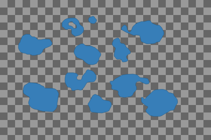
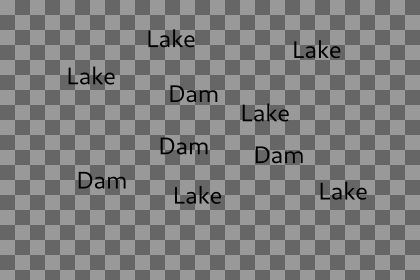
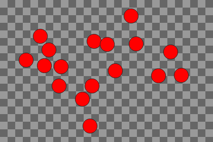
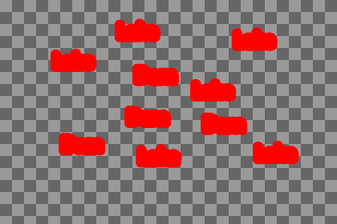
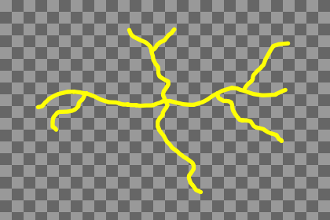
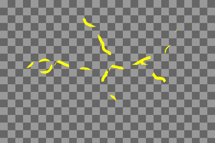
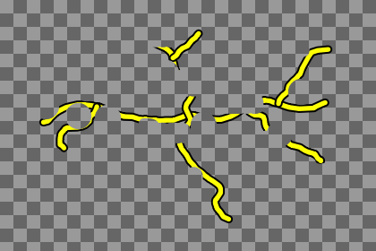
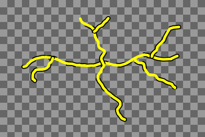
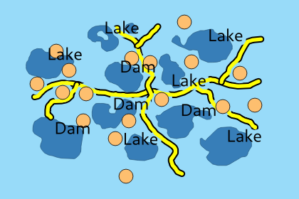

# Selective masking case 4

<table border=1>
      <tr>
        <td>Layers</td>
        <td><b>Polys</b></td>
        <td><b>Lines</b></td>
        <td><b>Points</b></td>
        <td><b>Labels</b></td>
      </tr>
      <tr>
        <td>Symbol layers</td>
        <td></td>
        <td><b>0</b>: black roads <b>1</b>: yellow roads</td>
        <td><b>0</b>: orange circles <b>1</b>: marker mask, bigger circle (only visible in mask image)</td>
        <td></td>
      </tr>
      <tr>
        <td>Masks</td>
        <td></td>
        <td></td>
        <td><b>Points/1</b> masks <b>Lines/1</b></td>
        <td>Buffer masks <b>Lines/0</b></td>
      </tr>
      <tr>
        <td>First pass</td>
        <td></td>
        <td></td>
        <td></td>
        <td></td>
      </tr>
      <tr>
        <td>Mask image (still in first pass)</td>
        <td></td>
        <td></td>
        <td></td>
        <td></td>
      </tr>
    </table>
Warning message: 
<b>Layer lines_ef106202_b4e1_49c4_a3d0_b65eb8bbb6d6 : Different sets of symbol layers are masked by different sources ! Only one (arbitrary) set will be retained !
</b>
<table border=1>
      <tr>
        <td>Second pass</td>
        <td><b>Lines</b> without <b>1</b> </td>
      </tr>
      <tr>
        <td>Composition with merged mask</td>
        <td></td>
      </tr>
      <tr>
        <td>Second pass image <b>inside</b> mask</td>
        <td></td>
      </tr>
      <tr>
        <td>First pass image <b>oustide</b> mask </td>
        <td></td>
      </tr>
      <tr>
        <td>Updated first pass image</td>
        <td></td>
      </tr>
</table>

Final image 

