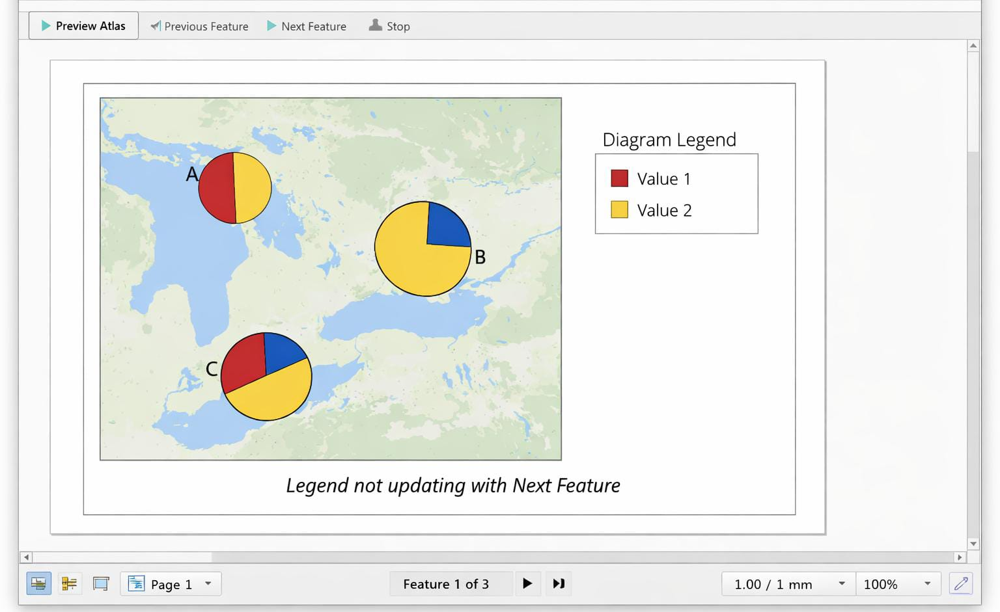

# Reproducing Bug #64615 – Atlas Pie Chart Legend

Steps to reproduce:

1. Create a scratch point layer with multiple features.
2. Add a Pie Chart diagram to the layer.
3. Open a new Print Layout and add the map.
4. Enable Atlas with the scratch layer as the coverage layer.
5. Set the map to "Controlled by Atlas".
6. Add a legend and open Atlas Preview.
7. Click "Next Feature" to move between pages.

Observed behavior:
- The pie chart legend does not update when changing atlas pages.

Attached screenshot:
